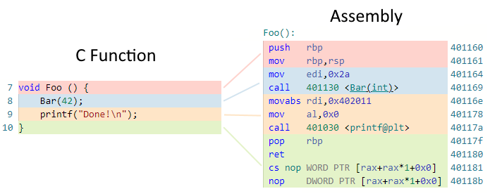
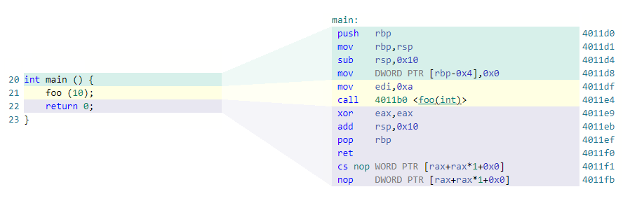
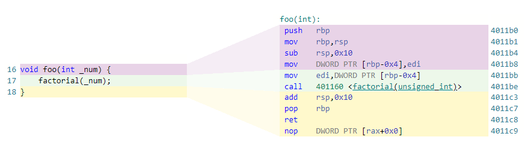
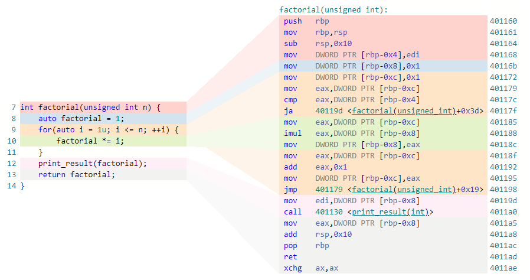
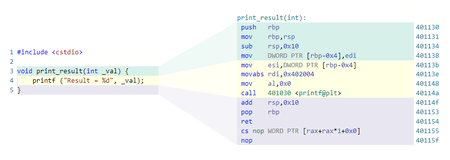
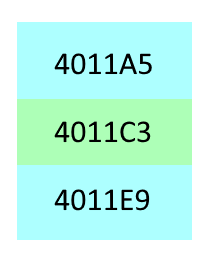
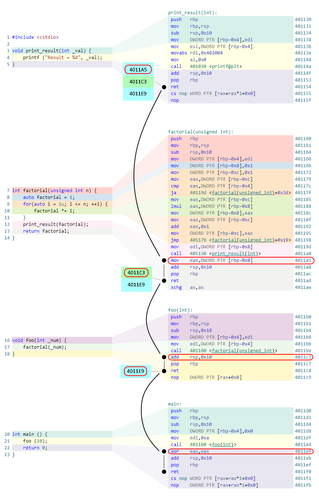

:information_source: Medium Level

# Tutorial: call-stack

According to [Wikipedia](https://en.wikipedia.org/wiki/Call\_stack), 

"*A call stack is a data structure that **stores information** about the **active subroutines** in a computer program*".

Functions (subroutines) are what ultimately our programs are made out of. Functions can call other functions, creating a stack of active subroutines. For example, function **Foo** calls function **Bar**, which in turn calls function **Baz**. If the program is currently executing **Baz**, the active functions on the call stack would be **Foo**, **Bar** and **Baz**.

The primary purpose of a *Call Stack* is to store return addresses for functions. However, depending on various factors like language, OS, etc. it might serve others purposes like parameter passing, local storage, etc. We will be focusing on the return addresses.

> It is important to note that a call stack is implemented using a [stack data structure](https://en.wikipedia.org/wiki/Stack_(abstract_data_type)), which follows the Last In, First Out (LIFO) order for adding and removing elements.

## Subroutines or functions

To understand what a call stack is, it's important to understand that subroutines or functions are a series of **assembly instructions** that are stored in memory and executed by the processor. Processors have special registers that keep track of the current instruction being executed and others that are used to transfer execution to a subroutine or return from it.

Given this simple program:

```c++
 1 #include <cstdio>
 2 
 3 void Bar(int _number) {
 4     printf("Number = %d\n", _number);
 5 }
 6 
 7 void Foo () {
 8     Bar(42);
 9     printf("Done!\n");
10 }
11 
12 int main () {
13     Foo();
14     return 0;
15 }
```

As an example, the compiler could translate the C **Foo** function into several assembly instructions like in the picture:


<br clear="left"/>

## A Basic Example

Let's reason around a particular example. Imagine that we have two functions **Foo** and **Bar**. The function **Foo** calls the function **Bar** with the value *42* as a parameter and after that, it prints out the message *Done!*. This would be the source code:

```c++
1 void Bar(int n);
2 void Foo () {
3    Bar(42);
4    printf("Done!\n");
5 }
```

As we mentioned before, depending on the compiler, language or even the OS the call stack can be used for other purposes like parameter passing. In our example, and for the sake of argument, only processor registers will be used to pass parameters.

Imagine that we eventually managed to pass the control to the function **Bar**. Also, imagine that **Bar** is done executing. What happens now? How do we restore the execution of **Foo**? How do we print out the message?

The answer to this comes from the [Calling Convention](https://en.wikipedia.org/wiki/Calling_convention) which describes how information is exchanged between subroutines and how the control is transferred between functions. By looking into the assembly code in our example we can spot the two assembly instructions that transfer the execution flow to another function and then return from it: ***CALL*** and ***RET*** respectively.

> It's important to note that while the discussion of assembly code may not be exhaustive, understanding how assembly instructions are used in the call stack is essential for a complete understanding of the topic.

The instruction [***CALL***](https://c9x.me/x86/html/file_module_x86_id_26.html) “*Saves procedure linking information on the stack and branches to the procedure*” and the instruction [***RET***](https://c9x.me/x86/html/file_module_x86_id_280.html) “*Transfers program control to a return address located on the top of the stack ... the return address is popped*”

So, in our example, Before **Bar** is executed two things happen:

* The compiler assigns 42 to a processor register
* The ***CALL*** assembly instruction:
  * Pushes the address of the next instruction (*printf*) into the stack, that's it, 0x40116e
  * And then, transfer the execution to the function **Bar**


Similarly, when **Bar** finishes executing its code, the ***RET*** assembly instruction will:

* Pop the return address from the stack (0x40116e)

* And then, it will transfer the execution to the retrieved address

## A more complex example

Let’s put into practice all we just learned by analysing a more complex example. We created this example with the amazing [Godbolt](https://godbolt.org/z/M9c3rc6nY) compiler explorer which:

```C++
 1 #include <cstdio>
 2 
 3 void print_result(int _val) {
 4     printf ("Result = %d", _val);
 5 }
 6 
 7 int factorial(unsigned int n) {
 8     auto factorial = 1;
 9     for(auto i = 1u; i <= n; ++i) {
10         factorial *= i;
11     }    
12     print_result(factorial);    
13     return factorial;
14 }
15 
16 void foo(int _num) {
17     factorial(_num);
18 }
19 
20 int main () {
21     foo (10);
22     return 0;
23 }
```

In this particular case the sequence of calls happen in the following order:

* *main* (called by the C++ runtime)
* *foo*
* *factorial*
* *print_result*

As you can see in the images, we have provided an example of how source code is translated into assembly instructions. The source code is on the left, with line numbers at the beginning of each line, while the corresponding assembly instructions are on the right, with memory addresses at the right side of each line.


<br clear="left"/>

It is important to note that there is **no direct one-to-one correspondence** between a line of source code and the corresponding assembly instructions. This is a **fundamental** concept to understand how memory addresses are translated into useful information for the CPU to execute instructions. In the following sections, we will delve deeper into how memory addresses are used in the execution of instructions and how it relates to the call stack.

Similarly, *foo* looks like this:


<br clear="left"/>

which is pretty much the same. Now, a more complex one; *factorial*:


<br clear="left"/>

This one is a bit more complex and shows us interesting things. Notice how some source code lines correspond to different non-sequential groups of instructions like the *for* loop in line 9 that corresponds to address blocks *[**401172**, **40117F**]* and *[**40118F**, **401198**]*.

Finally the *print_result* function:


<br clear="left"/>

So, what if we wanted to find out how the call stack would look like if we stopped the execution when we are about to run the *printf* function? In that particular case, the subroutines that are active are *main*, *foo*, *factorial* and *print_result*. 

Step by step!



Firstly at line 21, we need to look into the corresponding assembly instruction at **4011E4**. As we explained in the basic example section, the ***CALL*** assembly instruction will push into the stack the value **4011e9** which is the address of the next instruction commonly called the *return address*.

Similarly, once we are inside *foo* at source line 17 (assembly address **4011BE**), another ***CALL*** instruction will be executed, hence, the address **4011C3** will be pushed into the stack. So far, we have **4011E9** and on top of it **4011C3**. 

If we keep simulating until we just executed *print_result* (source line 5, assembly address **40114F**) the call stack inside the stack should be like this:

<br clear="right"/>

So, what happens now? Take a look at the picture and let’s reason about it!


<br clear="left"/>

Let’s suppose that the next instruction that is going to be executed is the one at **40114F** (Which corresponds to the line 5 of source code).

| line /  address | description of what happens as we step over                  |
| ----------------------------- | ------------------------------------------------------------ |
| 5 / 40114F                    | 2 instructions execute until ***RET*** (at **401154**) which will pop **4011A5** from the stack and transfer the execution to that memory address |
| 13 / 4011A5                   | It will execute 3 assembly instructions until ***RET*** at **4011AD** where it will pop **4011C3** from the stack and, again, transfer the execution to the address |
| 18 / 4011C3                   | Again, it will execute assembly until  ***RET*** at **4011C8** which will pop the last address in our example which is **4011E9** and transfer the execution |
| 22 / 4011E9                   | It will execute assembly until **RET** at **4011F0** which will pop from the stack the return address pushed by the **CALL** instruction that leads to the main function |

## Source/assembly correspondence

As we mentioned before and we could see in the pictures, one line of source code can be translated into multiple assembly instructions. What is more, it could correspond to different ranges of memory addresses that are not even contiguous. For instance, the source code at line 9 corresponds with two different non-contiguous blocks of code memory addresses.

This is something that depends completely on the compiler and can be determined by convenience or optimizations.

Also, the compilers often offer the ability to include this correspondence as part of the debugging information. Such a feature allows us to convert any code memory address into a filename and a line.

## Conclusions

*Call Stacks* are extremely important for tracing the behaviour of a program. **Debuggers** show us _Call Stacks_ as a breakpoint is hit, **Exception handling** code use _Call Stacks_ for showing the exact chain of calls, in some frameworks **assertions** use *Call Stacks* to give more context, etc. In summary, there are many known situations where using *Call Stacks* is useful.

To sum up:

* The call stack is a sequence of return addresses
* The return addresses are usually stored interleaved with other information like function parameters or local variables
* The instruction pair ***CALL***/***RET*** is the mechanism that controls the flow between subroutines
* There is no one-to-one correspondence between source code and assembly code
* Compilers can store the mapping between source code and assembly which allows us to convert any code memory address into filename/line.
