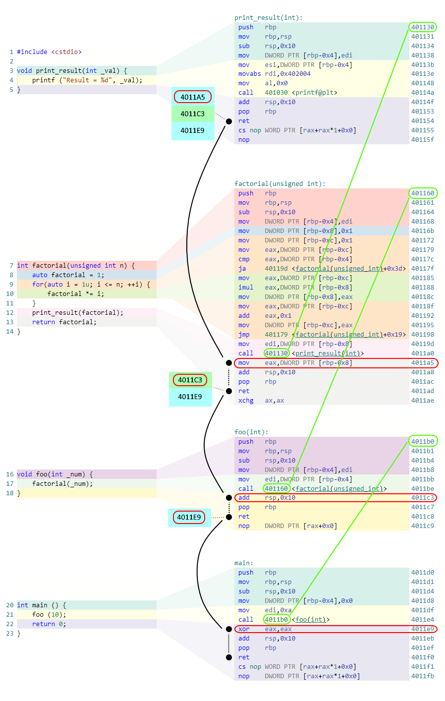

:information_source: Basic level

# Tutorial: call-stack

According to [Wikipedia](https://en.wikipedia.org/wiki/Call\_stack), 

"*A call stack is a data structure that **stores information** about the **active subroutines** in a computer program*".

What are **active subroutines**? We know that a program is a series of pieces of code usually organised in different subroutines. Subroutines call other subroutines generating a chain of calls. For instance, if a function **Foo** calls the function **Bar** and this calls the function **Baz** and we stopped the execution of the program while **Baz** is being executed, we say that **Foo**, **Bar**, and **Baz** are the **active subroutines**. When **Baz** stops executing and returns the control to **Bar** the **active subroutines** are **Foo** and **Bar**.

The Call Stack's primary purpose is to store return addresses. However, depending on various factors like language, OS, etc. it might serve others purposes like parameter passing, local storage, etc. This tutorial will be focusing only on the return addresses.

> Remember, the call stack is obviously stored in a [Stack](https://en.wikipedia.org/wiki/Stack_(abstract_data_type)) which is a data structure with two main operations: **Push** and **Pop**. Also, remember that the order in which an element is added to or removed from a stack is described as *last in*, *first out* also referred to as **LIFO**.

## A Basic Example

Let's reason around a particular example. Imagine that we have two functions **Foo** and **Bar**. The function **Foo** calls the function **Bar** with the value *42* as a parameter and after that, it prints out the message *Done!*:

```c++
1 void Bar(int n);
2 void Foo () {
3    Bar(42);
4    printf("Done!\n");
5 }
```

As we mentioned before, depending on various factors the call stack can be used for parameter passing. Suppose, for the sake of argument, that in our case only registers are used to pass parameters instead of the stack. In this case, the value 42 would be assigned to a processor register and then read by **Bar**.

Imagine that we eventually managed to pass the control to the function **Bar**. Also, imagine that **Bar** is done executing. What happens now? How do we restore the execution of **Foo**? How do we print out the message?

The answer to this comes from the [Calling Convention](https://en.wikipedia.org/wiki/Calling_convention) which describes how information is exchanged between subroutines and how the control is transferred between functions. By looking into the assembly code for our example we can spot the two assembly instructions that transfer the execution flow to another function and then return from it: ***CALL*** and ***RET*** respectively.

> Bare in mind that our intention in bringing the assembly to the discussion is not to be super thorough but it is **absolutely** essential that we do so if we wanted to understand correctly how the call stack works.

The instruction [***CALL***](https://c9x.me/x86/html/file_module_x86_id_26.html) “*Saves procedure linking information on the stack and branches to the procedure*” and the instruction [***RET***](https://c9x.me/x86/html/file_module_x86_id_280.html) “*Transfers program control to a return address located on the top of the stack ... the return address is popped*”

So, in our example, Before **Bar** is executed two things happen:

* The compiler assigns 42 to a processor register
* The ***CALL*** assembly instruction pushes the address of the next instruction (*printf*) into the stack
* The ***CALL*** assembly instruction transfer the execution to the function **Bar**

Similarly, when **Bar** finishes executing its code:

* The ***RET*** assembly instruction will pop the return address from the stack 
* The ***RET*** assembly instruction will transfer the execution to the retrieved address

## A more complex example

Let’s put into practice all we just learned by analysing a more complex example:

```C++
 1 #include <cstdio>
 2 
 3 void print_result(int _val) {
 4     printf ("Result = %d", _val);
 5 }
 6 
 7 int factorial(unsigned int n) {
 8     auto factorial = 1;
 9     for(auto i = 1u; i <= n; ++i) {
10         factorial *= i;
11     }    
12     print_result(factorial);    
13     return factorial;
14 }
15 
16 void foo(int _num) {
17     factorial(_num);
18 }
19 
20 int main () {
21     foo (10);
22     return 0;
23 }
```

In this particular case the sequence of calls is in this order:

* *main* (called by the C++ runtime among others before it), 
* *foo*, 
* *factorial*
* *print_result*. 

Let's go further and see how this program translates into Assembly. For that, we will be using the amazing [Godbolt](https://godbolt.org/z/M9c3rc6nY) compiler explorer. Check out the link and explore it yourself.

The main function source code and corresponding binary assembly code generated will be like this:


On the left, there is the source code with the line numbers at the beginning of each line, and on the right, there are the corresponding assembly instructions. The numbers on the right side of each line are the memory addresses of the assembly instructions. 

Notice that there is **no 1:1 correspondence** between a line in the source code and the corresponding assembly instructions. This is **fundamental** in order to understanding how code memory addresses will be translated into useful information. More about that later.

Similarly, *foo* looks like this:


which is pretty much the same. Now, a more complex one; *factorial*:


This one is a bit more complex and shows us interesting things. Notice how some source lines of code correspond to different non-sequential groups of instructions like the *for* loop in line 9 that corresponds to address blocks *[**401172**, **40117F**]* and *[**40118F**, **401198**]*.

Finally the *print_result* function:


So, what if we wanted to find out how the call stack would look like if we stopped the execution when we are about to run the *printf* function? In that particular case, the subroutines that are active are *main*, *foo*, *factorial* and *print_result*. 

Step by step!

Firstly at line 21, we need to look into the corresponding assembly instruction at **4011E4**. As we described before, the ***CALL*** assembly instruction will push into the stack the value **4011e9** which is the address of the next instruction commonly called the *return address*. 

Similarly, once we are inside *foo* at source line 17 (assembly address **4011BE**), another ***CALL*** will be invoked, hence, the address **4011C3** will be pushed into the stack. We have two so far: **4011E9** and on top of it **4011C3**. 

If we keep simulating until we just executed *print_result* (source line 5, assembly address **40114F**) the call stack inside the stack should be like this:


So, what happens now? Take a look at the picture and let’s reason about it!



Let’s execute instruction by instruction from **40114F**

| source line /  asm address | description of what happens as we step over                  |
| ----------------------------- | ------------------------------------------------------------ |
| 5 / 40114F                    | 2 instructions execute until ***RET*** (at **401154**) which will pop **4011A5** from the stack and transfer the execution to that memory address |
| 13 / 4011A5                   | It will execute 3 assembly instructions until ***RET*** at **4011AD** where it will pop **4011C3** from the stack and, again, transfer the execution to the address |
| 18 / 4011C3                   | Again, it will execute assembly until  ***RET*** at **4011C8** which will pop the last address in our example which is **4011E9** and transfer the execution |
| 22 / 4011E9                   | It will execute assembly until **RET** at **4011F0** which will pop from the stack the return address pushed by the **CALL** instruction that leads to the main function |

## Source <-> assembly correspondence

As we mentioned before and we could see in the pictures, one line of source code can be translated into multiple assembly instructions. What is more, it could correspond to different ranges of memory addresses that are not even contiguous. For instance, the source code at line 9 corresponds with two different non-contiguous blocks of code memory addresses.

The compilers often offer the ability to include this as part of the debugging information. Such a feature allows us to convert any code memory address into a filename and a line.

## Conclusions

* The call stack is a sequence of return addresses
* The return addresses can be stored interleaved with other information like parameters
* The instruction pair ***CALL***/***RET*** is the mechanism that controls the flow between subroutines
* There is no 1:1 correspondence between source code and assembly code
